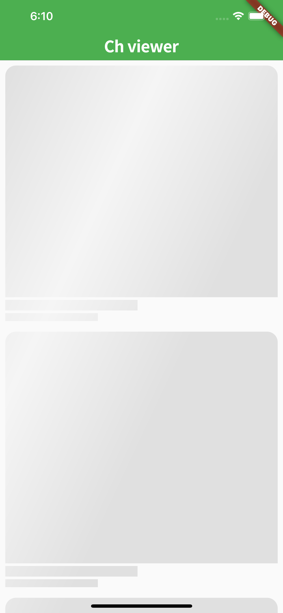
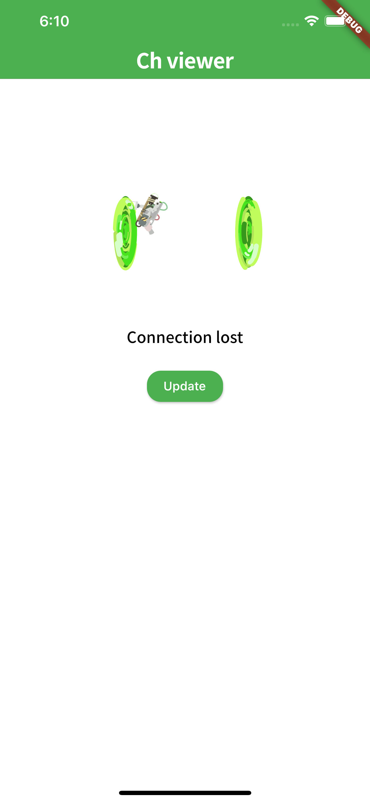
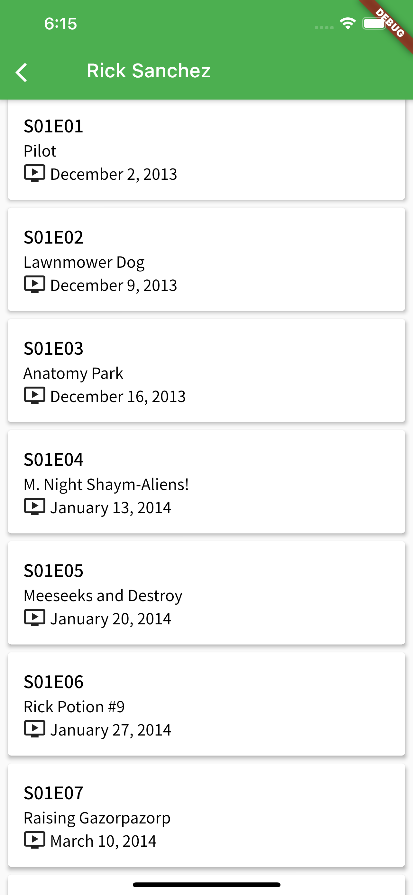
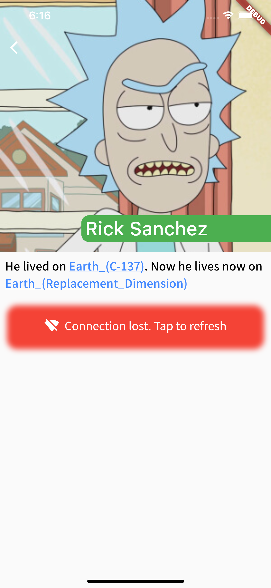
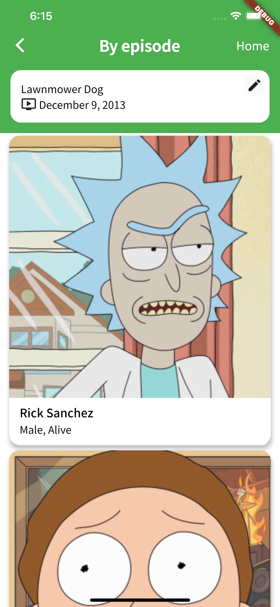
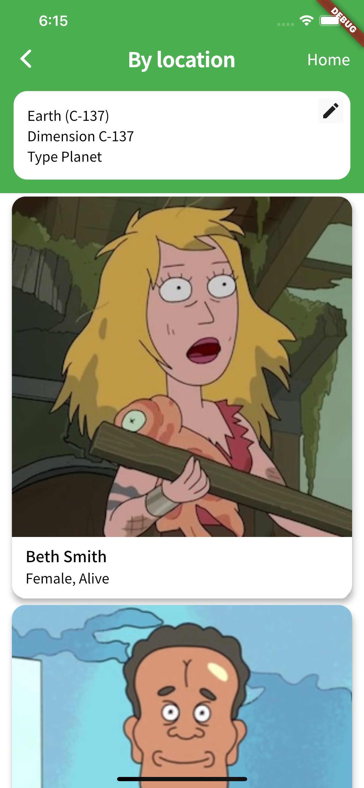
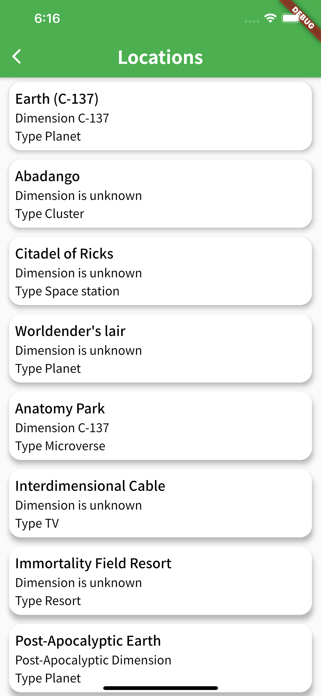

Rick and forty Viewer is an application written with Flutter to explore platform capabilities and using <a href="https://rickandmortyapi.com/">The Rick and Morty API</a>
  

    

Main Screen 

  
  
  

Character info screen

  
  
  

Characters by episode/location screen

  
  

All episodes/location screens

  
  

